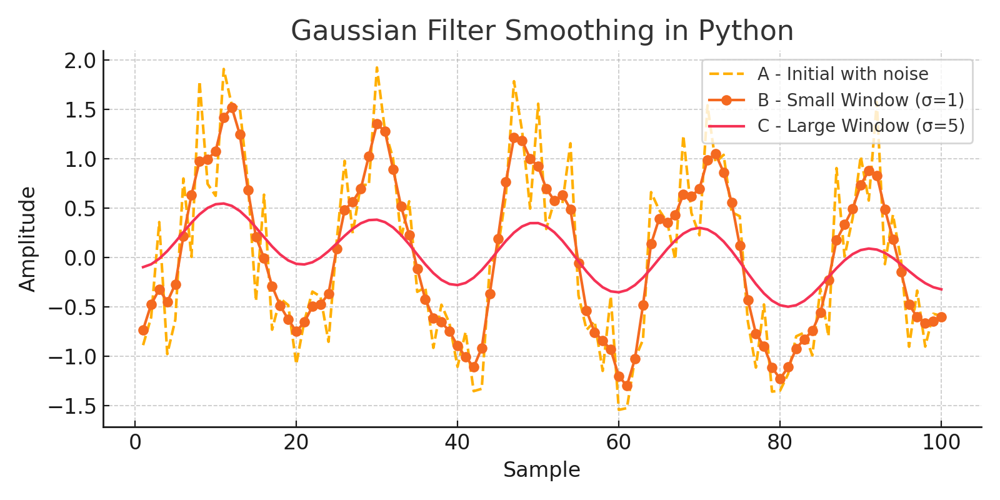

# Gaussian Filter: Signal Smoothing Comparison (MATLAB & Python)

This small project demonstrates how Gaussian filters can be used to smooth a noisy signal using both **MATLAB** and **Python** implementations. It compares the effect of using a small vs. large window for smoothing, and visualizes the results.

## 🔧 Description

- A noisy cosine signal is generated.
- Two smoothing windows are applied:
  - A **small Gaussian window** (size = 4)
  - A **large Gaussian window** (size = 20)
- The smoothed results are compared visually.

## 📊 Visualization

Below is the graph comparing original and smoothed signals:



## 💻 MATLAB Code

```matlab
% Gaussian Filter with Initial Signal A
x = 1:100;
A = cos(2*pi*0.05*x + 2*pi*rand) + 0.5*randn(1,100);
[B, window] = smoothdata(A, 'gaussian'); % default window ~4
C = smoothdata(A, 'gaussian', 20);       % window = 20

% Plotting
plot(x, A, '--', x, B, '-o', x, C, '-x')
legend('A - Initial with noise', 'B - Small Window = 4', 'C - Large Window = 20')
title('Gaussian Filter Smoothing in MATLAB')
xlabel('Sample')
ylabel('Amplitude')
```

## 🐍 Python Equivalent

```python
import numpy as np
import matplotlib.pyplot as plt
from scipy.ndimage import gaussian_filter1d

x = np.arange(1, 101)
A = np.cos(2 * np.pi * 0.05 * x + 2 * np.pi * np.random.rand()) + 0.5 * np.random.randn(100)
B = gaussian_filter1d(A, sigma=1)     # ~ small window
C = gaussian_filter1d(A, sigma=5)     # larger window (smoother)

# Plotting
plt.plot(x, A, '--', label='A - Initial with noise')
plt.plot(x, B, '-o', label='B - Small Window (σ=1)')
plt.plot(x, C, '-x', label='C - Large Window (σ=5)')
plt.legend()
plt.title('Gaussian Filter Smoothing in Python')
plt.xlabel('Sample')
plt.ylabel('Amplitude')
plt.grid(True)
plt.tight_layout()
plt.show()
```

## 📦 Requirements

For Python:
```bash
pip install numpy matplotlib scipy
```

## ✅ Learning Outcomes

- Understand the concept of signal smoothing
- Apply Gaussian filtering in both MATLAB and Python
- Visualize and interpret how window size affects smoothness
- Practice translating code between MATLAB and Python

## 📁 Files

- `gaussian_filter_comparison.md` (this file)
- `gaussian_filter_comparison.png` (plot image)
- `gaussian_filter_matlab.m` (MATLAB script)
- `gaussian_filter_python.py` (Python script)

## 📎 License

Feel free to use or modify. MIT License.
